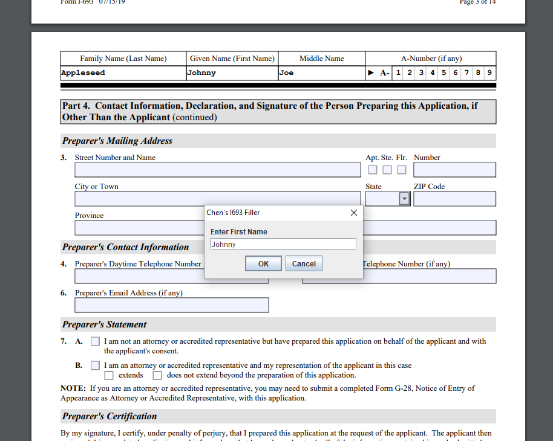

# I693_Filler
I693 Filler assists immigrants and doctors in filling out USCIS Form I-693. 

The [USCIS Form I-693](https://www.uscis.gov/i-693) is a form for immigrants to report medical examinations and vaccinations. On each of its 14 pages, it contains A-number and name fields that cannot be digitally filled by some applications such as Chrome. Because this is a tedious task for medical doctors, who may have to prepare this form several times a day, this program was designed to quickly fill these fields with the inputted information and produce the PDF. It has a repeat function which can be used to generate several PDF's in a short amount of time.
